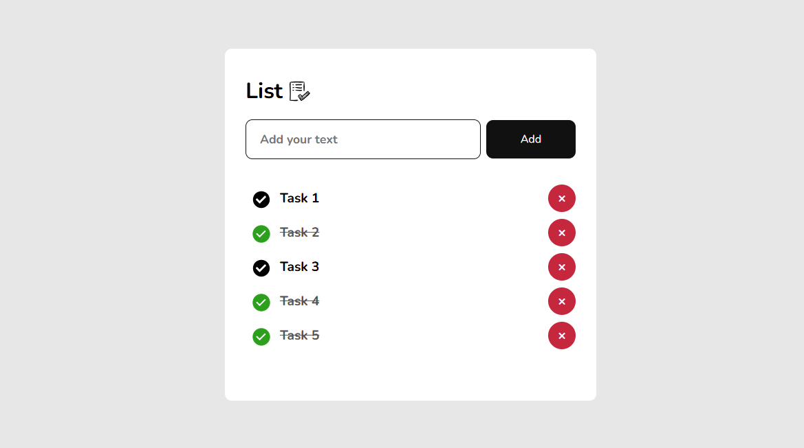

# **📝 To-Do List with Persistent Data**

This project is a modern, fully responsive To-Do List application built with HTML, CSS, and JavaScript, offering a clean and intuitive way to manage daily tasks. The app uses 
localStorage to save task data, ensuring that your to-do items remain intact even if you refresh or leave the page.

Users can add tasks to the list, mark them as "checked" or "unchecked", and remove tasks effortlessly by clicking the "X" icon. The layout is built with Flexbox, providing a 
visually appealing and responsive design that adapts perfectly to screens of all sizes.

# **🛠️ Main Features**

- **HTML, CSS & JavaScript Implementation**
- **Persistent Data Storage with LocalStorage**
- **Mark Tasks as "Checked" or "Unchecked"**
- **Remove Tasks with a Clickable "X" Icon**
- **Modern and Responsive Design using Flexbox**
- **Simple and Elegant UI/UX Design**

# **📷 Screenshot**

